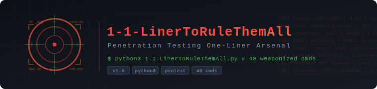

# 1-1-LinerToRuleThemAll

<p align="center">
  
</p>

**Built by: [SkyzFallin](https://github.com/SkyzFallin)**

**40 weaponized penetration testing one-liners wrapped in an interactive Python CLI. Set your target once, browse by category, search by keyword, and copy ready-to-fire commands with the domain already swapped in -- or grab the raw template with `target.com` intact.**


---

## What It Does

This is a curated arsenal of 40 advanced one-liner commands used during authorized penetration testing and bug bounty engagements, organized into an interactive terminal menu. Instead of digging through notes or bookmarks, you set your target domain once and the tool handles substitution across every command.

Each command is categorized, searchable, and presented with both a raw version (placeholder `target.com`) and a targeted version (your actual domain). Copy either version to your clipboard or terminal with a single keystroke.

---

## Categories

| #  | Category                          | Commands | Coverage |
|----|-----------------------------------|----------|----------|
| 1  | Extreme Reconnaissance            | 5        | subfinder, dnsx, httpx, nuclei, crt.sh, gau, hakrawler |
| 2  | Weaponized Authentication Attacks | 5        | Password spraying, JWT exploitation, OAuth chains, session hijacking, MFA bypass |
| 3  | Injection Attacks (Extreme)       | 5        | Blind SQLi, polyglot injection, NoSQLi, SSTI, XXE |
| 4  | SSRF & Deserialization            | 4        | AWS metadata, blind SSRF, ysoserial, GraphQL SSRF |
| 5  | Logic Flaws & Business Logic      | 4        | Race conditions, IDOR, parameter pollution, mass assignment |
| 6  | Full Exploitation Chains          | 7        | XSS-to-exfil, cloud escape, subdomain takeover, API key theft, prototype pollution, CORS abuse, K8s exploitation |
| 7  | Advanced Evasion & Bypasses       | 5        | WAF bypass, IP restriction bypass, rate limit evasion, CSP bypass, GraphQL DoS |
| 8  | Advanced Exploitation             | 5        | Open redirect chains, blind XXE, GraphQL batch bombs, WebSocket hijack, prototype pollution RCE |

---

## Quick Start

```
git clone https://github.com/SkyzFallin/1-1-LinerToRuleThemAll.git
cd 1-1-LinerToRuleThemAll
python3 1-1-LinerToRuleThemAll.py
```

No dependencies. Runs on Python 3.6+ with only the standard library.

---

## Usage

On launch you'll see the ASCII banner and legal disclaimer, then a prompt for your target domain:

```
  Enter the target domain (or press Enter to keep 'target.com'):
  > example.com

  [*] Target set to: example.com
```

From there, the main menu lets you:

```
  CATEGORIES:
  ----------
  [1] EXTREME RECONNAISSANCE
  [2] WEAPONIZED AUTHENTICATION ATTACKS
  [3] INJECTION ATTACKS (EXTREME)
  [4] SSRF & DESERIALIZATION
  [5] LOGIC FLAWS & BUSINESS LOGIC
  [6] FULL EXPLOITATION CHAINS
  [7] ADVANCED EVASION & BYPASSES
  [8] ADVANCED EXPLOITATION
  [A] ALL COMMANDS
  [P] PROFILE filter
  [S] SEARCH commands by keyword
  [Q] QUIT
```

Select a category to browse, pick a command by number, and you get:

```
  ========================================
  #1 | EXTREME RECONNAISSANCE
  Full Infrastructure Mapping with Passive + Active Intelligence Fusion
  ========================================

  [RAW COMMAND] (target.com placeholder)
  ----------------------------------------

  subfinder -d target.com -all -silent | dnsx -silent ...

  [TARGETED COMMAND] (target: example.com)
  ----------------------------------------

  subfinder -d example.com -all -silent | dnsx -silent ...

  ----------------------------------------
  [C] Copy targeted command   [R] Copy raw command
  [B] Back to list            [Q] Quit
```

Clipboard support auto-detects `xclip`, `xsel`, or `pbcopy`. If none are available it prints the command in a clean block for manual copy/paste.

---


## Export Mode (JSON / Markdown)

You can now export the command catalog non-interactively for notes, reports, or automation:

```bash
# Export all commands with target substitution
python3 1-1-LinerToRuleThemAll.py --target example.com --export json --out commands.json

# Export only cloud-profile commands in Markdown
python3 1-1-LinerToRuleThemAll.py --target example.com --profile cloud --export md --out cloud-playbook.md
```

Available profiles: `web`, `api`, `cloud`, `auth`, `graphql`.

Each command now includes lightweight metadata in the interactive list/view: **risk**, **noise**, and **profiles**.

---

## Tool Dependencies

The one-liners themselves call external tools. These are **not** bundled -- install what you need for your workflow:

| Tool | Purpose | Install |
|------|---------|---------|
| `subfinder` | Subdomain discovery | `go install github.com/projectdiscovery/subfinder/v2/cmd/subfinder@latest` |
| `dnsx` | DNS toolkit | `go install github.com/projectdiscovery/dnsx/cmd/dnsx@latest` |
| `httpx` | HTTP probing | `go install github.com/projectdiscovery/httpx/cmd/httpx@latest` |
| `nuclei` | Vulnerability scanner | `go install github.com/projectdiscovery/nuclei/v3/cmd/nuclei@latest` |
| `notify` | Notification engine | `go install github.com/projectdiscovery/notify/cmd/notify@latest` |
| `gau` | URL fetcher | `go install github.com/lc/gau/v2/cmd/gau@latest` |
| `hakrawler` | Web crawler | `go install github.com/hakluke/hakrawler@latest` |
| `qsreplace` | Query string manipulation | `go install github.com/tomnomnom/qsreplace@latest` |
| `anew` | Unique line appender | `go install github.com/tomnomnom/anew@latest` |
| `jwt_tool` | JWT testing | `pip install jwt_tool` |
| `websocat` | WebSocket client | `cargo install websocat` |
| `parallel` | Parallel execution | `apt install parallel` |
| `jq` | JSON processor | `apt install jq` |
| `ysoserial` | Java deserialization | Manual install |
| `impacket` | Network protocols | `pip install impacket` |
| `aws` | AWS CLI | `apt install awscli` |
| `kubectl` | Kubernetes CLI | Official install |

---

## Project Structure

```
1-1-LinerToRuleThemAll/
  1-1-LinerToRuleThemAll.py   # Main script (self-contained)
  banner.svg                   # GitHub README header graphic
  README.md                    # This file
  LICENSE                      # GPL-3.0 license
```

---

## Legal Disclaimer

```
  *** LEGAL DISCLAIMER ***

  These one-liners are WEAPONIZED commands intended for use ONLY during
  AUTHORIZED penetration testing engagements and bug bounty programs.

  Unauthorized use against systems you do not own or have explicit
  written permission to test is ILLEGAL and UNETHICAL.

  YOU are solely responsible for your actions. Deploy responsibly.
```

---

## License

GPL-3.0 -- see [LICENSE](LICENSE).
